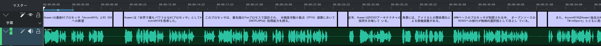

# VOICEVOX-SRT
VOICEVOXから**字幕の自動配置が可能なSRTファイルを生成する**ツール。


  
  
  
  
  


## 特長
- 完璧なタイミングの字幕を生成。出力されるSRTファイルは、音声の再生時間に合わせて字幕が表示されるようになっています。kdenliveなどの動画編集ソフトに読み込ませることで、**字幕の自動配置が可能**です。手作業の煩雑さを大幅に減らします！
- 適切な文節で改行を行います。



[YouTubeで見る](https://youtu.be/QAqP9a-IJHo)

## 使い方
1. VOICEVOXで音声を生成します。
2. プロジェクトを`vvproj`として保存します。
3. `voicevox-srt.py`を実行します。
   ```python
   python voicevox-srt.py
   ```
4. SRTファイルをkdenliveなどの動画編集ソフトに読み込ませます。
5. 字幕の自動配置が完了しました。

## 利用規約
VOICEVOX利用規約( https://voicevox.hiroshiba.jp/term/ )と共に、以下の内容を必ずお守りいただいたうえでVOICEVOX-SRTをご使用ください。
個人がVOICEVOX-SRTを用いて生成したSRTファイルを用いて作成した動画は、
「VOICEVOX-SRT: https://github.com/yKesamaru/voicevox-srt」
とクレジットを記載すれば商用・非商用問わず利用可能です。
ただし企業が携わる形で利用する場合は「y.kesamaru@tokai-kaoninsho.com」に対し事前確認をとる必要があります。

## アルゴリズムの概要
入力のJSON形式のvvprojファイルから、テキストの自然な分割と音声時間の詳細な計算を行い、スライディングウィンドウ方式、ウィンドウ内句読点探索、およびトークンベース再分割などの技法を用いて各字幕行のレイアウトを最適化することで、可読性の高いSRT字幕ファイルを生成しています。

### 文節の分割
- 文節分割とスライディングウィンドウ方式
  - 本コードでは、まずfugashi（MeCabのPythonラッパー）を用いて入力テキストを形態素解析し、文末の句点（「。」「！」「？」など）や改行を検出して自然な文節に分割します。
  - 得られた文節群に対して、スライディングウィンドウ方式を適用し、各字幕行が最大文字数（デフォルト29文字）を超えないようグリーディに連結します。
  - 単一の文節が長すぎる場合には、ウィンドウ内で句読点（「、」「。」など）の位置を探索して分割します。
    ※ この際、分割後の残り部分の先頭が句読点の場合、その句読点を前のセグメントに付加することで、句読点が孤立しないようにしています。
  - さらに、隣接する行で非常に短い行や、英単語が途中で分断される場合には、前後の行をマージしてトークン単位で再分割する処理を追加し、英単語が途中で改行されないようにしています。

### vvprojファイルの利用方法
#### JSON構造について
-`"talk"`キー
  vvprojファイルのトップレベルに存在し、トーク全体に関する情報を含んでいます。

-`"audioItems"`キー
  `"talk"`内にあり、各音声項目（字幕に対応する）の辞書の集合です。
  -各音声項目の`"text"`キーには、字幕として表示するテキストが格納されています。
  -同じ音声項目の`"query"`キーには、発話データが含まれており、そこから以下の情報を取得します:
    -`"accentPhrases"`:各アクセントフレーズに関する情報。
    -`"moras"`:各アクセントフレーズ内で、各モーラの`"vowelLength"`（母音の長さ）と`"consonantLength"`（子音の長さ）。
    -`"pauseMora"`:アクセントフレーズ間のポーズを示す情報（主に`"vowelLength"`）。
    -`"prePhonemeLength"`と`"postPhonemeLength"`:発話前後の無音時間。

### 各字幕の時間の長さを得るアルゴリズム
#### 音声時間計算の流れ
関数`calculate_audio_duration(query)`において、各音声項目の`"query"`辞書から以下の情報を取得し、音声の再生時間を算出しています。
1. アクセントフレーズ内のモーラ計算
   - 各`"accentPhrases"`内の`"moras"`リストを走査し、各モーラの`"vowelLength"`と`"consonantLength"`を合計します。

2. ポーズの考慮
   - 各アクセントフレーズ内に存在する`"pauseMora"`の`"vowelLength"`を加算し、アクセントフレーズ間の間隔（ポーズ）を反映させます。

3. 前後の無音時間の付加
   - `"prePhonemeLength"`と`"postPhonemeLength"`の値を加算することで、発話開始前および終了後の無音部分も考慮しています。

この総和をもとに、各字幕ブロックの開始時刻は累積時間、終了時刻は開始時刻に発話時間を加えたものとなり、SRTフォーマット（hh:mm:ss,ms）に整形して出力されます。

#### 補足: 英単語の途中改行の防止
`adjust_line_breaks`関数では、隣接する行のうち、前行の末尾と次行の先頭がともに英字の場合や、次行が非常に短い場合に、これらの行をマージして再分割する処理を行います。これにより、英単語が途中で改行されることなく、単語全体が前行に収まるように調整されます。


